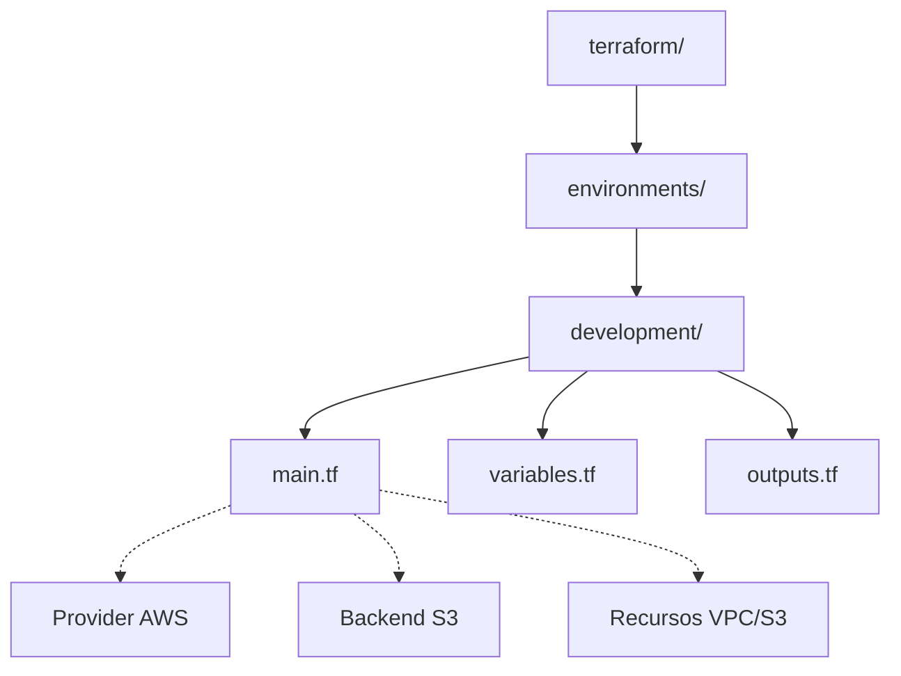
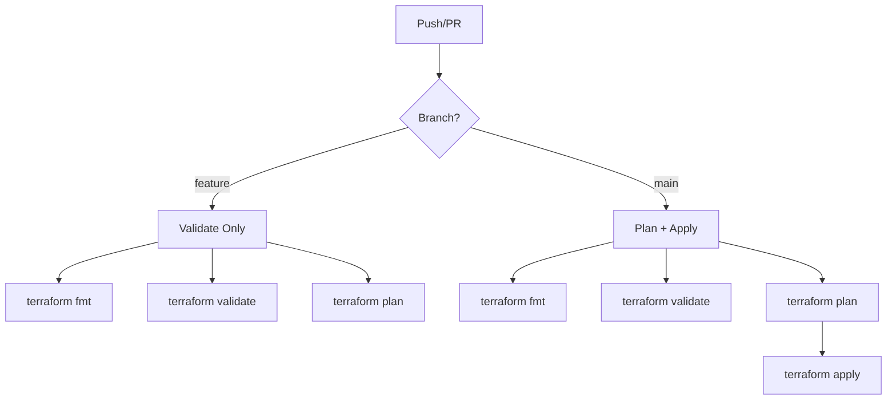
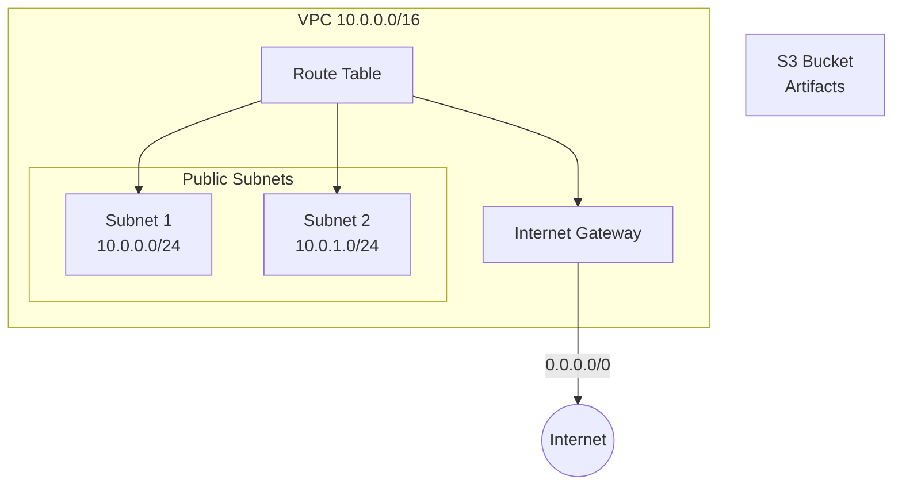
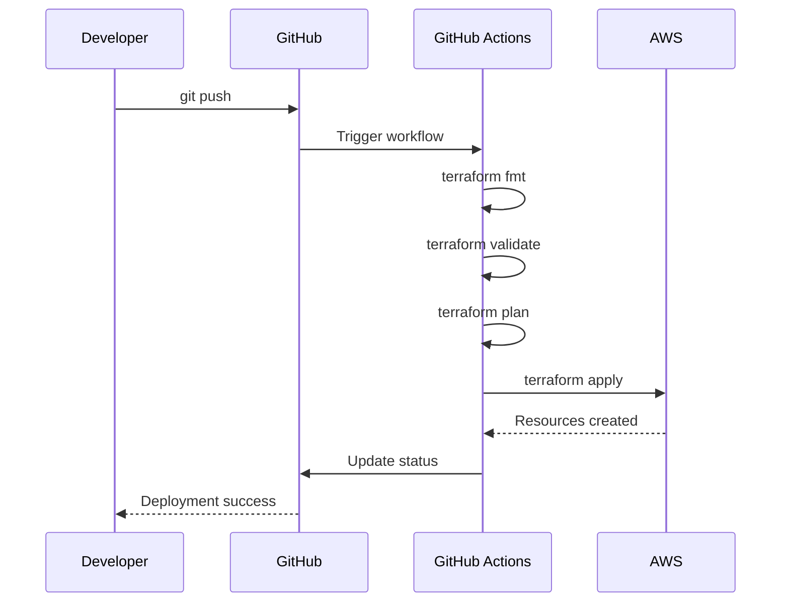
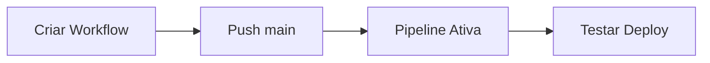

# 🎬 Vídeo 5.1 - Terraform Básico e Pipeline IaC

**Aula**: 5 - Infrastructure as Code  
**Vídeo**: 5.1  
**Temas**: Pipeline IaC; GitOps; Terraform CI/CD; Automação  

---

## 📚 Parte 1: Conceito Infrastructure as Code

### Passo 1: O que é IaC?

```mermaid
graph LR
    A[Manual] -->|Problemas| B[Erro Humano]
    A -->|Problemas| C[Não Reproduzível]
    A -->|Problemas| D[Sem Versionamento]
    
    E[IaC/Terraform] -->|Benefícios| F[Reproduzível]
    E -->|Benefícios| G[Versionado Git]
    E -->|Benefícios| H[Auditável]
    E -->|Benefícios| I[Automatizado]
```



**Sem IaC (Manual):**
```
Console AWS → Click, click, click
- Erro humano
- Não reproduzível
- Sem versionamento
- Lento
```

**Com IaC (Terraform):**
```
Código → terraform apply → Infraestrutura
- Reproduzível
- Versionado (Git)
- Auditável
- Rápido
```

**Benefícios:**
- ✅ **Versionamento**: Git history
- ✅ **Reutilização**: Módulos
- ✅ **Consistência**: Mesmo código = mesma infra
- ✅ **Documentação**: Código é a documentação
- ✅ **Automação**: CI/CD para infra

---

## 🚀 Parte 2: Pipeline-First Approach

### Passo 2: Por que Pipeline-First?

```mermaid
graph LR
    A[Código] --> B[Git Push]
    B --> C[Pipeline CI/CD]
    C --> D[Terraform Plan]
    D --> E[Review]
    E --> F[Terraform Apply]
    F --> G[Infraestrutura]
```



**Pipeline-First vs. Local-First:**
```
❌ Local-First:
Dev → terraform apply local → "funciona na minha máquina"

✅ Pipeline-First:
Dev → git push → pipeline → infraestrutura consistente
```

**Benefícios Pipeline-First:**
- ✅ **Consistência**: Mesmo ambiente sempre
- ✅ **Auditoria**: Todos os deploys rastreados
- ✅ **Segurança**: Credenciais centralizadas
- ✅ **Colaboração**: Time inteiro usa mesmo processo

### Passo 3: Estrutura Pipeline-Ready

```bash
# Estrutura otimizada para pipeline
tree .
```

**Estrutura Pipeline-Ready:**
```
.
├── .github/
│   └── workflows/
│       └── terraform-ci.yml      # Pipeline principal
├── terraform/
│   └── environments/
│       └── development/          # Ambiente dev
│           ├── main.tf           # Configuração principal
│           ├── variables.tf      # Variáveis
│           └── outputs.tf        # Outputs
└── README.md
```



---

## 🔄 Parte 3: Pipeline CI/CD Setup

### Passo 4: Criar Bucket S3 para Backend (Pré-requisito)

> ⚠️ **IMPORTANTE**: O bucket S3 precisa existir ANTES de rodar a pipeline!

**Linux/macOS:**
```bash
# Criar bucket para armazenar o state do Terraform
aws s3 mb s3://fiap-terraform-state-dev --region us-east-1 --profile fiapaws

# Verificar se foi criado
aws s3 ls --profile fiapaws | grep fiap-terraform
```

**Windows (PowerShell):**
```powershell
# Criar bucket para armazenar o state do Terraform
aws s3 mb s3://fiap-terraform-state-dev --region us-east-1 --profile fiapaws

# Verificar se foi criado
aws s3 ls --profile fiapaws | Select-String "fiap-terraform"
```

### Passo 5: Configurar GitHub Secrets

```bash
# No GitHub: Settings > Secrets and variables > Actions
# Adicionar secrets do AWS Learner Lab:
```

**Secrets necessários:**
```
AWS_ACCESS_KEY_ID     = AKIA...
AWS_SECRET_ACCESS_KEY = wJa...
AWS_SESSION_TOKEN     = IQoJ... (obrigatório no Learner Lab)
```

### Passo 6: Criar Pipeline Principal

```bash
# Criar workflow principal
mkdir -p .github/workflows
```

**Pipeline Strategy:**


### Passo 6: Infraestrutura como Código

**O que será criado pela pipeline:**
- ✅ VPC com subnets públicas
- ✅ Internet Gateway e Route Tables  
- ✅ S3 Bucket para artefatos
- ✅ Tags padronizadas
- ✅ Backend S3 para state



---

## 🚀 Parte 4: Pipeline Workflow



### Passo 7: Criar Workflow CI/CD

**Linux/macOS:**
```bash
# Criar diretório e arquivo workflow
mkdir -p .github/workflows

cat > .github/workflows/terraform-ci.yml << 'EOF'
name: 🏗️ Terraform CI/CD

on:
  push:
    branches: [ main ]
    paths: [ 'terraform/**' ]

env:
  AWS_REGION: us-east-1
  TF_VERSION: 1.6.0
  WORKING_DIR: terraform/environments/development

jobs:
  terraform-deploy:
    name: 🚀 Deploy
    runs-on: ubuntu-latest
    
    steps:
      - name: 📥 Checkout
        uses: actions/checkout@v4
      
      - name: 🔧 Setup Terraform
        uses: hashicorp/setup-terraform@v3
        with:
          terraform_version: ${{ env.TF_VERSION }}
      
      - name: 🔑 Configure AWS
        uses: aws-actions/configure-aws-credentials@v4
        with:
          aws-access-key-id: ${{ secrets.AWS_ACCESS_KEY_ID }}
          aws-secret-access-key: ${{ secrets.AWS_SECRET_ACCESS_KEY }}
          aws-session-token: ${{ secrets.AWS_SESSION_TOKEN }}
          aws-region: ${{ env.AWS_REGION }}
      
      - name: 🎯 Format Check
        working-directory: ${{ env.WORKING_DIR }}
        run: terraform fmt -check -recursive
      
      - name: ⚙️ Init
        working-directory: ${{ env.WORKING_DIR }}
        run: terraform init
      
      - name: ✅ Validate
        working-directory: ${{ env.WORKING_DIR }}
        run: terraform validate
      
      - name: 📋 Plan
        working-directory: ${{ env.WORKING_DIR }}
        run: terraform plan -out=tfplan
      
      - name: 🚀 Apply
        working-directory: ${{ env.WORKING_DIR }}
        run: terraform apply -auto-approve tfplan
      
      - name: 📊 Output
        working-directory: ${{ env.WORKING_DIR }}
        run: |
          echo "## 🏗️ Infrastructure Deployed" >> $GITHUB_STEP_SUMMARY
          echo '```' >> $GITHUB_STEP_SUMMARY
          terraform output >> $GITHUB_STEP_SUMMARY
          echo '```' >> $GITHUB_STEP_SUMMARY
EOF
```

**Windows (PowerShell):**
```powershell
# Criar diretório
New-Item -ItemType Directory -Force -Path ".github/workflows"

# Criar arquivo (copiar conteúdo YAML acima manualmente)
notepad .github/workflows/terraform-ci.yml
```

---

## 🧪 Parte 5: Testar Pipeline



### Passo 8: Subir Workflow para Main (PRIMEIRO!)

> ⚠️ **IMPORTANTE**: O workflow precisa estar na branch `main` para o GitHub Actions reconhecer!

```bash
# Garantir que está na main
git checkout main

# Adicionar o workflow
git add .github/workflows/terraform-ci.yml
git commit -m "ci: add terraform pipeline"
git push origin main
```

### Passo 9: Testar Deploy Automático

```bash
# Fazer uma alteração no terraform para triggerar a pipeline
echo "# Pipeline test $(date)" >> terraform/environments/development/main.tf

# Commit e push
git add .
git commit -m "test: trigger terraform pipeline"
git push origin main
```

**O que acontece:**
- ✅ Push para `main` com alteração em `terraform/**`
- ✅ Pipeline é triggerada automaticamente
- ✅ Terraform fmt, init, validate, plan, apply
- ✅ Infraestrutura criada na AWS

### Passo 10: Monitorar Pipeline

**No GitHub Actions:**
```
GitHub > Actions > Terraform CI/CD > Ver execução

✅ Format Check
✅ Init
✅ Validate
✅ Plan
✅ Apply
✅ Output (Summary)
```

```bash
# Verificar recursos criados via AWS CLI
aws ec2 describe-vpcs --filters "Name=tag:Project,Values=fiap-cicd" --profile fiapaws
aws s3 ls --profile fiapaws | grep fiap-cicd
```

---

### Passo 12: Recapitular

**Terraform workflow:**
```
1. terraform init   → Inicializar
2. terraform plan   → Ver mudanças
3. terraform apply  → Aplicar mudanças
4. terraform output → Ver outputs
```

**Componentes:**
- ✅ **Provider**: AWS
- ✅ **Backend**: S3
- ✅ **Resources**: VPC, Subnets, etc
- ✅ **Variables**: Parametrização
- ✅ **Outputs**: Valores de saída

**Pipeline IaC:**
- ✅ Validate → Format + Validate
- ✅ Plan → Ver mudanças (PR)
- ✅ Apply → Aplicar (main branch)

---

## 🧹 Limpeza (Destruir Recursos)

```bash
cd terraform/environments/development
terraform destroy -auto-approve

# Verificar se foi destruído
aws ec2 describe-vpcs --filters "Name=tag:Project,Values=fiap-cicd" --profile fiapaws
```

---

**FIM DO VÍDEO 5.1** ✅
