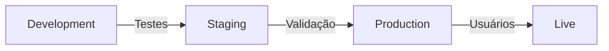
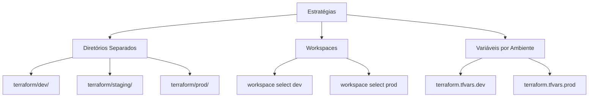
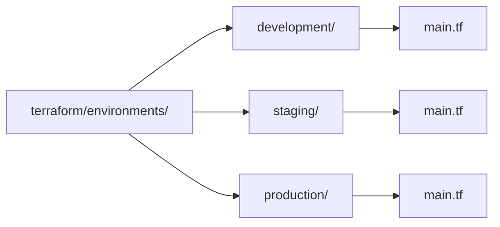
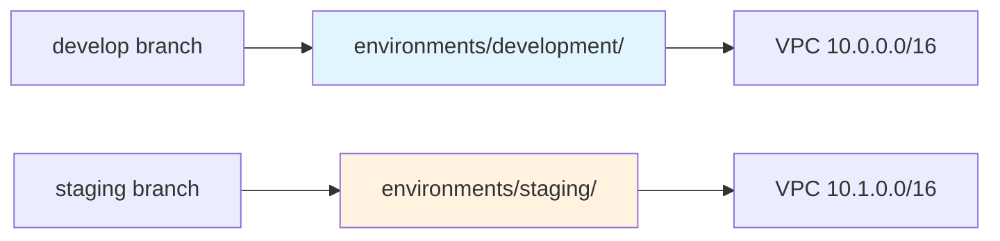

# 🎬 Vídeo 5.2 - Multi-Ambientes com Terraform

**Aula**: 5 - Infrastructure as Code  
**Vídeo**: 5.2  
**Temas**: Pipeline Multi-Ambiente; Promoção Automática; GitOps; Aprovações  

---

## 📚 Parte 1: Conceito Multi-Ambientes

### Passo 1: Por que Múltiplos Ambientes?



**Ambientes típicos:**
```
Development → Staging → Production
    ↓            ↓          ↓
  Testes    Validação   Usuários
```

**Estratégias Terraform:**



```
1. Diretórios separados
   terraform/dev/
   terraform/staging/
   terraform/prod/

2. Workspaces
   terraform workspace select dev
   terraform workspace select prod

3. Variáveis por ambiente
   terraform.tfvars.dev
   terraform.tfvars.prod
```

---

## 🏗️ Parte 2: Modelo Multi-Ambiente Simples

### Passo 2: Escolha do Modelo

**Modelo escolhido**: **Diretórios por Ambiente** (isolamento completo)



### Passo 3: Estrutura Multi-Ambiente

```
terraform/
├── environments/
│   ├── development/     # Ambiente dev (VIDEO-5.1)
│   │   ├── main.tf
│   │   ├── variables.tf
│   │   └── outputs.tf
│   └── staging/         # Ambiente staging (VIDEO-5.2)
│       ├── main.tf
│       ├── variables.tf
│       └── outputs.tf
└── modules/             # Módulos reutilizáveis (VIDEO-5.3)
    ├── vpc/
    ├── security-group/
    └── s3/
```

---

## 📝 Parte 3: Ambiente Staging (Já Criado)

> **Nota**: O ambiente staging já foi criado e está disponível em `terraform/environments/staging/`

### Passo 4: Verificar Ambiente Staging

**Linux/macOS:**
```bash
# Verificar estrutura staging
ls -la terraform/environments/staging/

# Ver diferenças entre ambientes
diff terraform/environments/development/main.tf terraform/environments/staging/main.tf
```

**Windows (PowerShell):**
```powershell
# Verificar estrutura staging
Get-ChildItem terraform/environments/staging/

# Ver conteúdo
Get-Content terraform/environments/staging/main.tf
```

### Passo 5: Diferenças entre Ambientes

| Configuração | Development | Staging |
|--------------|-------------|---------|
| **Backend S3** | `fiap-terraform-state-dev` | `fiap-terraform-state-staging` |
| **VPC CIDR** | `10.0.0.0/16` | `10.1.0.0/16` |
| **Tags** | `Environment = "development"` | `Environment = "staging"` |

---

## 🚀 Parte 4: Pipeline Multi-Ambiente

### Passo 6: Testar Ambientes Localmente

**Linux/macOS:**
```bash
# Testar development
cd terraform/environments/development
terraform init
terraform plan
terraform apply

# Testar staging
cd ../staging
terraform init
terraform plan
terraform apply

# Ver recursos criados
terraform output
```

**Windows (PowerShell):**
```powershell
# Testar development
cd terraform/environments/development
terraform init
terraform plan
terraform apply

# Testar staging
cd ../staging
terraform init
terraform plan
terraform apply

# Ver recursos criados
terraform output
```

### Passo 7: Criar Workflow Multi-Ambiente

**Linux/macOS:**
```bash
cat > .github/workflows/multi-env.yml << 'EOF'
name: 🏗️ Multi-Environment

on:
  push:
    branches: [ develop, staging ]

jobs:
  deploy-dev:
    name: 🔧 Development
    runs-on: ubuntu-latest
    if: github.ref == 'refs/heads/develop'
    
    steps:
      - name: 📥 Checkout
        uses: actions/checkout@v4
      
      - name: 🔧 Setup Terraform
        uses: hashicorp/setup-terraform@v3
      
      - name: 🔑 Configure AWS
        uses: aws-actions/configure-aws-credentials@v4
        with:
          aws-access-key-id: ${{ secrets.AWS_ACCESS_KEY_ID }}
          aws-secret-access-key: ${{ secrets.AWS_SECRET_ACCESS_KEY }}
          aws-session-token: ${{ secrets.AWS_SESSION_TOKEN }}
          aws-region: us-east-1
      
      - name: ⚙️ Init & Deploy Dev
        working-directory: terraform/environments/development
        run: |
          terraform init
          terraform apply -auto-approve

  deploy-staging:
    name: 🧪 Staging  
    runs-on: ubuntu-latest
    if: github.ref == 'refs/heads/staging'
    
    steps:
      - name: 📥 Checkout
        uses: actions/checkout@v4
      
      - name: 🔧 Setup Terraform
        uses: hashicorp/setup-terraform@v3
      
      - name: 🔑 Configure AWS
        uses: aws-actions/configure-aws-credentials@v4
        with:
          aws-access-key-id: ${{ secrets.AWS_ACCESS_KEY_ID }}
          aws-secret-access-key: ${{ secrets.AWS_SECRET_ACCESS_KEY }}
          aws-session-token: ${{ secrets.AWS_SESSION_TOKEN }}
          aws-region: us-east-1
      
      - name: ⚙️ Init & Deploy Staging
        working-directory: terraform/environments/staging
        run: |
          terraform init
          terraform apply -auto-approve
EOF
```

**Windows (PowerShell):**
```powershell
# Criar workflow multi-ambiente (copiar conteúdo acima)
New-Item -ItemType File -Path ".github/workflows/multi-env.yml"
```

---

## 🧪 Parte 5: Testar Pipeline Multi-Ambiente

### Passo 8: Testar Deploy Development

```bash
# Criar branch develop (se não existir)
git checkout -b develop

# Fazer uma alteração (ex: adicionar comentário)
echo "# Deploy test $(date)" >> terraform/environments/development/main.tf

# Commit e push
git add .
git commit -m "test: trigger development deploy"
git push origin develop

# Ver pipeline no GitHub Actions
# https://github.com/SEU_USUARIO/SEU_REPO/actions
```

### Passo 9: Testar Deploy Staging

```bash
# Criar branch staging
git checkout main
git checkout -b staging

# Fazer uma alteração
echo "# Deploy test $(date)" >> terraform/environments/staging/main.tf

# Commit e push
git add .
git commit -m "test: trigger staging deploy"
git push origin staging

# Ver pipeline no GitHub Actions
```

### Passo 10: Verificar Deploys

```bash
# Ver recursos development
aws ec2 describe-vpcs \
  --filters "Name=tag:Environment,Values=development" \
  --query "Vpcs[*].{ID:VpcId,CIDR:CidrBlock}" \
  --profile fiapaws

# Ver recursos staging
aws ec2 describe-vpcs \
  --filters "Name=tag:Environment,Values=staging" \
  --query "Vpcs[*].{ID:VpcId,CIDR:CidrBlock}" \
  --profile fiapaws
```

---

## 🎯 Resumo Multi-Ambiente



**Fluxo simples:**
1. **Push para `develop`** → Deploy automático em **Development**
2. **Push para `staging`** → Deploy automático em **Staging**
3. **Diretórios** isolam os ambientes completamente
4. **Branches** controlam qual ambiente é deployado

---

## 🧹 Limpeza (Destruir Recursos)

```bash
# Destruir staging
cd terraform/environments/staging
terraform destroy -auto-approve

# Verificar se foi destruído
aws ec2 describe-vpcs --filters "Name=tag:Environment,Values=staging" --profile fiapaws
```

---

## 🎬 Fim do Vídeo 5.2

**Conceitos aprendidos:**
- ✅ Diretórios por ambiente
- ✅ Isolamento completo de configurações
- ✅ Pipeline multi-ambiente
- ✅ GitOps com branches
