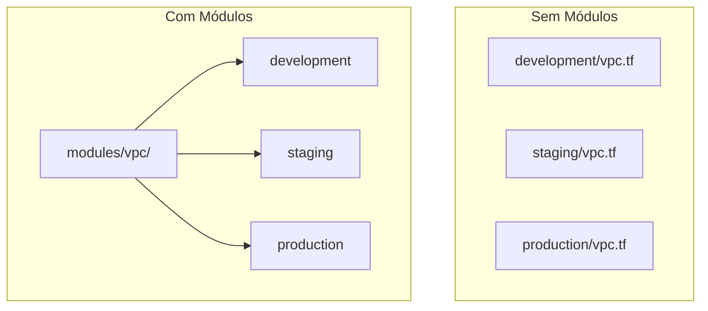
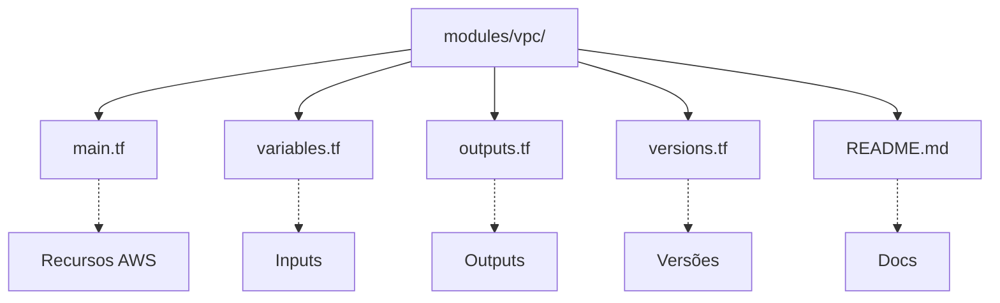
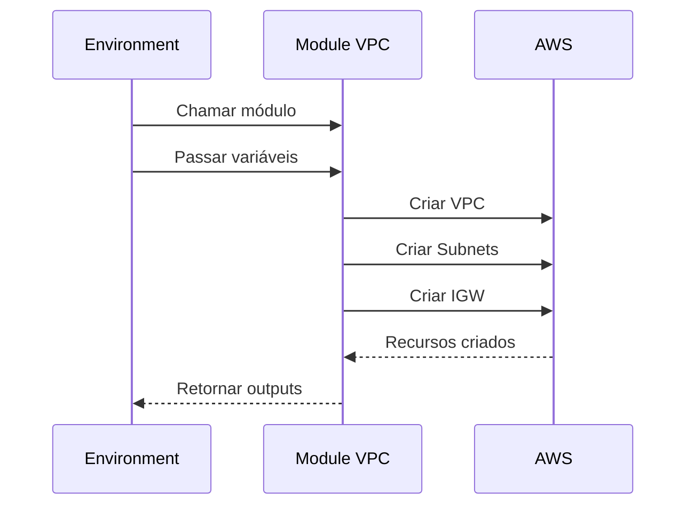
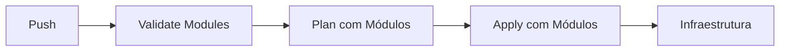

# 🎬 Vídeo 5.3 - Módulos Terraform Reutilizáveis

**Aula**: 5 - Infrastructure as Code  
**Vídeo**: 5.3  
**Temas**: Módulos na Pipeline; Versionamento; Testes; Registry Privado  

---

## 📚 Parte 1: Conceito de Módulos

### Passo 1: Por que Módulos?



**Sem módulos:**
```
Código duplicado em cada ambiente
- development/vpc.tf
- staging/vpc.tf  
- production/vpc.tf

❌ Difícil manter
❌ Inconsistências
❌ Sem reutilização
```

**Com módulos:**
```
modules/vpc/ → Código único
  ↓
development → usa módulo
staging → usa módulo
production → usa módulo

✅ DRY (Don't Repeat Yourself)
✅ Consistência
✅ Reutilização
```

---

## 📦 Parte 2: Módulos Prontos

### Passo 2: Explorar Módulos Disponíveis



**Módulos disponíveis:**
```
terraform/modules/
├── vpc/              # Módulo VPC completo
│   ├── main.tf       # VPC, subnets, IGW, NAT
│   ├── variables.tf  # Configurações flexíveis
│   ├── outputs.tf    # IDs e ARNs
│   └── README.md     # Documentação
├── security-group/   # Módulo Security Group
│   ├── main.tf       # SG com regras dinâmicas
│   ├── variables.tf  # Regras configuráveis
│   └── outputs.tf    # SG ID
└── s3/              # Módulo S3 Bucket
    ├── main.tf       # Bucket com features
    ├── variables.tf  # Configurações S3
    └── outputs.tf    # Bucket info
```

### Passo 3: Usar Módulos na Pipeline

**Linux/macOS:**
```bash
# Criar arquivo usando módulos
cat > main-with-modules.tf << 'EOF'
# ============================================
# VPC MODULE
# ============================================
module "vpc" {
  source = "./modules/vpc"

  name                = "fiap-cicd"
  vpc_cidr           = "10.0.0.0/16"
  public_subnet_count = 2
  private_subnet_count = 0  # Learner Lab
  enable_nat_gateway  = false  # Economizar

  tags = {
    Environment = "development"
    Project     = "fiap-cicd"
    ManagedBy   = "terraform"
  }
}

# ============================================
# SECURITY GROUP MODULE
# ============================================
module "web_sg" {
  source = "./modules/security-group"

  name        = "fiap-web"
  description = "Web servers security group"
  vpc_id      = module.vpc.vpc_id

  ingress_rules = [
    {
      from_port   = 80
      to_port     = 80
      protocol    = "tcp"
      cidr_blocks = ["0.0.0.0/0"]
      description = "HTTP"
    }
  ]

  tags = {
    Environment = "development"
    Project     = "fiap-cicd"
  }
}
EOF
```

**Windows (PowerShell):**
```powershell
@"
# ============================================
# VPC MODULE
# ============================================
module "vpc" {
  source = "./modules/vpc"

  name                = "fiap-cicd"
  vpc_cidr           = "10.0.0.0/16"
  public_subnet_count = 2
  private_subnet_count = 0  # Learner Lab
  enable_nat_gateway  = false  # Economizar

  tags = {
    Environment = "development"
    Project     = "fiap-cicd"
    ManagedBy   = "terraform"
  }
}

# ============================================
# SECURITY GROUP MODULE
# ============================================
module "web_sg" {
  source = "./modules/security-group"

  name        = "fiap-web"
  description = "Web servers security group"
  vpc_id      = module.vpc.vpc_id

  ingress_rules = [
    {
      from_port   = 80
      to_port     = 80
      protocol    = "tcp"
      cidr_blocks = ["0.0.0.0/0"]
      description = "HTTP"
    }
  ]

  tags = {
    Environment = "development"
    Project     = "fiap-cicd"
  }
}
"@ | Out-File -FilePath "main-with-modules.tf" -Encoding UTF8
```

---

## 🚀 Parte 4: Pipeline CI/CD para Módulos

### Passo 4: Testar Módulos Localmente

**Linux/macOS:**
```bash
# Inicializar Terraform
terraform init

# Validar módulos
terraform validate

# Ver plano com módulos
terraform plan

# Aplicar (se estiver ok)
terraform apply
```

**Windows (PowerShell):**
```powershell
# Inicializar Terraform
terraform init

# Validar módulos
terraform validate

# Ver plano com módulos
terraform plan

# Aplicar (se estiver ok)
terraform apply
```

### Passo 5: Pipeline GitHub Actions

**Linux/macOS:**
```bash
# Criar workflow para módulos
cat > .github/workflows/modules-ci.yml << 'EOF'
name: 🧩 Modules CI/CD

on:
  push:
    branches: [ main ]
    paths: [ 'terraform/modules/**' ]
  pull_request:
    branches: [ main ]
    paths: [ 'terraform/modules/**' ]

jobs:
  test-modules:
    name: 🧪 Test Modules
    runs-on: ubuntu-latest
    
    steps:
      - name: 📥 Checkout
        uses: actions/checkout@v4
      
      - name: 🔧 Setup Terraform
        uses: hashicorp/setup-terraform@v3
        with:
          terraform_version: 1.6.0
      
      - name: 🎯 Format Check
        run: terraform fmt -check -recursive terraform/modules/
      
      - name: ✅ Validate Modules
        run: |
          for module in terraform/modules/*/; do
            echo "Validating $module"
            cd $module
            terraform init -backend=false
            terraform validate
            cd - > /dev/null
          done
EOF
```

**Windows (PowerShell):**
```powershell
# Criar workflow para módulos (copiar conteúdo acima)
New-Item -ItemType File -Path ".github/workflows/modules-ci.yml"
```



### Passo 6: Usar Módulo Localmente

```hcl
# terraform/environments/development/main.tf
module "vpc" {
  source = "../../modules/vpc"

  name               = "fiap-cicd-dev"
  vpc_cidr           = "10.0.0.0/16"
  availability_zones = ["us-east-1a", "us-east-1b"]
  
  public_subnet_cidrs  = ["10.0.1.0/24", "10.0.2.0/24"]
  private_subnet_cidrs = ["10.0.10.0/24", "10.0.20.0/24"]

  tags = {
    Environment = "development"
    Project     = "fiap-cicd"
  }
}

# Usar outputs do módulo
output "vpc_id" {
  value = module.vpc.vpc_id
}

output "public_subnets" {
  value = module.vpc.public_subnet_ids
}
```

### Passo 7: Testar Módulo

```bash
cd terraform/environments/development

# Init (baixa módulo)
terraform init

# Plan
terraform plan

# Apply
terraform apply
```

---

## � Parte 4: Pipeline CI/CD com Módulos



### Passo 8: Criar Pipeline para Módulos

**Linux/macOS:**
```bash
cat > .github/workflows/terraform-modules.yml << 'EOF'
name: 🧩 Terraform com Módulos

on:
  push:
    branches: [ modules ]

jobs:
  terraform:
    name: 🏗️ Deploy com Módulos
    runs-on: ubuntu-latest
    
    steps:
      - name: 📥 Checkout
        uses: actions/checkout@v4
      
      - name: 🔧 Setup Terraform
        uses: hashicorp/setup-terraform@v3
        with:
          terraform_version: 1.6.0
      
      - name: 🔑 Configure AWS
        uses: aws-actions/configure-aws-credentials@v4
        with:
          aws-access-key-id: ${{ secrets.AWS_ACCESS_KEY_ID }}
          aws-secret-access-key: ${{ secrets.AWS_SECRET_ACCESS_KEY }}
          aws-session-token: ${{ secrets.AWS_SESSION_TOKEN }}
          aws-region: us-east-1
      
      - name: ✅ Validate Modules
        run: |
          echo "🔍 Validando módulos..."
          for module in terraform/modules/*/; do
            echo "Validando $module"
            cd $module
            terraform init -backend=false
            terraform validate
            cd - > /dev/null
          done
      
      - name: ⚙️ Terraform Init
        working-directory: terraform/environments/development
        run: terraform init
      
      - name: 📋 Terraform Plan
        working-directory: terraform/environments/development
        run: terraform plan -out=tfplan
      
      - name: 🚀 Terraform Apply
        if: github.ref == 'refs/heads/main'
        working-directory: terraform/environments/development
        run: terraform apply -auto-approve tfplan
      
      - name: 📊 Summary
        working-directory: terraform/environments/development
        run: |
          echo "## 🧩 Infraestrutura com Módulos" >> $GITHUB_STEP_SUMMARY
          echo '```' >> $GITHUB_STEP_SUMMARY
          terraform output >> $GITHUB_STEP_SUMMARY || echo "No outputs" >> $GITHUB_STEP_SUMMARY
          echo '```' >> $GITHUB_STEP_SUMMARY
EOF
```

**Windows (PowerShell):**
```powershell
# Criar workflow (copiar conteúdo acima)
New-Item -ItemType File -Path ".github/workflows/terraform-modules.yml"
```

### Passo 9: Testar Pipeline com Módulos

```bash
# Criar branch modules
git checkout main
git checkout -b modules

# Fazer uma alteração nos módulos
echo "# Modules test $(date)" >> terraform/modules/vpc/main.tf

# Commit e push
git add .
git commit -m "feat: test modules pipeline"
git push origin modules

# Ver execução no GitHub Actions
# https://github.com/SEU_USUARIO/SEU_REPO/actions
```

### Passo 10: Verificar Resultado

```bash
# Ver outputs da infraestrutura
cd terraform/environments/development
terraform output

# Verificar VPC criada pelo módulo
aws ec2 describe-vpcs \
  --filters "Name=tag:Project,Values=fiap-cicd" \
  --query "Vpcs[*].{ID:VpcId,CIDR:CidrBlock}" \
  --profile fiapaws
```

---

## � Fim do Vídeo 5.3

**Conceitos aprendidos:**
- ✅ Módulos Terraform locais
- ✅ Estrutura de módulos (main.tf, variables.tf, outputs.tf)
- ✅ Pipeline CI/CD com validação de módulos
- ✅ Reutilização de código

**Estrutura de módulo:**
```
terraform/modules/vpc/
├── main.tf       # Recursos
├── variables.tf  # Inputs
└── outputs.tf    # Outputs
```

**Uso na pipeline:**
```hcl
module "vpc" {
  source = "../../modules/vpc"
  
  name     = "fiap-cicd-dev"
  vpc_cidr = "10.0.0.0/16"
}
```

---

## 🧹 Limpeza (Opcional)

```bash
cd terraform/environments/development
terraform destroy
# Confirmar: yes
```

---

**FIM DO VÍDEO 5.3** ✅

**FIM DA AULA 5** 🎓
