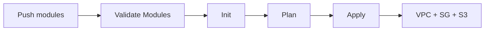

# 🎬 Vídeo 5.3 - Pipeline CI/CD com Módulos Terraform

## 📋 Objetivo

Criar uma pipeline CI/CD que utiliza **módulos Terraform locais** para provisionar infraestrutura.

---

## 📁 Estrutura do Projeto

```
fiap-dclt-aula05/
├── .github/workflows/
│   └── terraform-modules.yml       # Pipeline para módulos
├── terraform/
│   ├── environments/
│   │   ├── development/            # VIDEO-5.1 (recursos diretos)
│   │   ├── staging/                # VIDEO-5.2 (multi-ambiente)
│   │   └── modules/                # VIDEO-5.3 (usa módulos!) ← NOVO
│   │       ├── main.tf             # Chama os módulos
│   │       └── outputs.tf
│   └── modules/                    # Módulos reutilizáveis
│       ├── vpc/
│       ├── security-group/
│       └── s3/
```

### Diferença entre Environments

| Environment | Descrição | Usa Módulos? |
|-------------|-----------|--------------|
| `development` | Recursos criados diretamente | ❌ Não |
| `staging` | Multi-ambiente | ❌ Não |
| `modules` | Usa módulos locais | ✅ Sim |

---

## 🚀 Parte 1: Criar Pipeline

### Passo 1: Criar Workflow

> **Arquivo**: `.github/workflows/terraform-modules.yml`

**Linux/macOS:**
```bash
cat > .github/workflows/terraform-modules.yml << 'EOF'
name: 🧩 Terraform Modules

on:
  push:
    branches: [ modules ]

jobs:
  deploy:
    name: 🏗️ Deploy com Módulos
    runs-on: ubuntu-latest
    
    steps:
      - name: 📥 Checkout
        uses: actions/checkout@v4
      
      - name: 🔧 Setup Terraform
        uses: hashicorp/setup-terraform@v3
        with:
          terraform_version: 1.6.0
      
      - name: 🔑 Configure AWS
        uses: aws-actions/configure-aws-credentials@v4
        with:
          aws-access-key-id: ${{ secrets.AWS_ACCESS_KEY_ID }}
          aws-secret-access-key: ${{ secrets.AWS_SECRET_ACCESS_KEY }}
          aws-session-token: ${{ secrets.AWS_SESSION_TOKEN }}
          aws-region: us-east-1
      
      - name: ✅ Validate Modules
        run: |
          for module in terraform/modules/*/; do
            echo "📦 Validando $module"
            cd $module
            terraform init -backend=false
            terraform validate
            cd - > /dev/null
          done
      
      - name: ⚙️ Init
        working-directory: terraform/environments/modules
        run: terraform init
      
      - name: 📋 Plan
        working-directory: terraform/environments/modules
        run: terraform plan -out=tfplan
      
      - name: 🚀 Apply
        working-directory: terraform/environments/modules
        run: terraform apply -auto-approve tfplan
EOF
```

**Windows (PowerShell):**
```powershell
notepad .github/workflows/terraform-modules.yml
# Copiar conteúdo YAML acima
```

---

## 🧪 Parte 2: Preparar e Testar

### Passo 2: Criar Bucket S3 para Backend

> ⚠️ **IMPORTANTE**: O bucket precisa existir antes de rodar a pipeline!

```bash
aws s3 mb s3://fiap-terraform-state-modules --region us-east-1 --profile fiapaws
```

### Passo 3: Subir Workflow para Main

> ⚠️ **IMPORTANTE**: Workflow precisa estar na `main` primeiro!

```bash
git checkout main
git add .github/workflows/terraform-modules.yml
git commit -m "ci: add modules pipeline"
git push origin main
```

### Passo 4: Criar Branch e Testar

```bash
# Criar branch modules
git checkout -b modules

# Fazer alteração para triggerar pipeline
echo "# Test $(date)" >> terraform/modules/vpc/main.tf

# Push
git add .
git commit -m "test: trigger modules pipeline"
git push origin modules
```

### Passo 5: Verificar no GitHub Actions

```
GitHub > Actions > Terraform Modules > Ver execução

✅ Checkout
✅ Setup Terraform
✅ Configure AWS
✅ Validate Modules (vpc, security-group, s3)
✅ Init
✅ Plan
✅ Apply
```

---

## 📊 Fluxo da Pipeline



---

## 🎯 Resumo

| Item | Valor |
|------|-------|
| **Branch** | `modules` |
| **Workflow** | `.github/workflows/terraform-modules.yml` |
| **Módulos usados** | `vpc`, `security-group`, `s3` |
| **Environment** | `terraform/environments/modules` |
| **Backend S3** | `fiap-terraform-state-modules` |
| **VPC CIDR** | `10.2.0.0/16` |

---

## 📁 Arquivos Criados

| Arquivo | Descrição |
|---------|-----------|
| `terraform/environments/modules/main.tf` | Chama os módulos |
| `terraform/environments/modules/outputs.tf` | Outputs dos módulos |
| `.github/workflows/terraform-modules.yml` | Pipeline CI/CD |

---

## 🧹 Limpeza (Destruir Recursos)

```bash
# Destruir recursos criados com módulos
cd terraform/environments/modules
terraform destroy -auto-approve

# Verificar se foi destruído
aws ec2 describe-vpcs --filters "Name=tag:Environment,Values=modules" --profile fiapaws
```

---

## 🎬 Fim do Vídeo 5.3

**Conceitos aprendidos:**
- ✅ Módulos Terraform locais
- ✅ Environment dedicado para módulos
- ✅ Pipeline CI/CD com validação de módulos
- ✅ Branch dedicada (`modules`)

---

**FIM DO VÍDEO 5.3** ✅

**FIM DA AULA 5** 🎓
